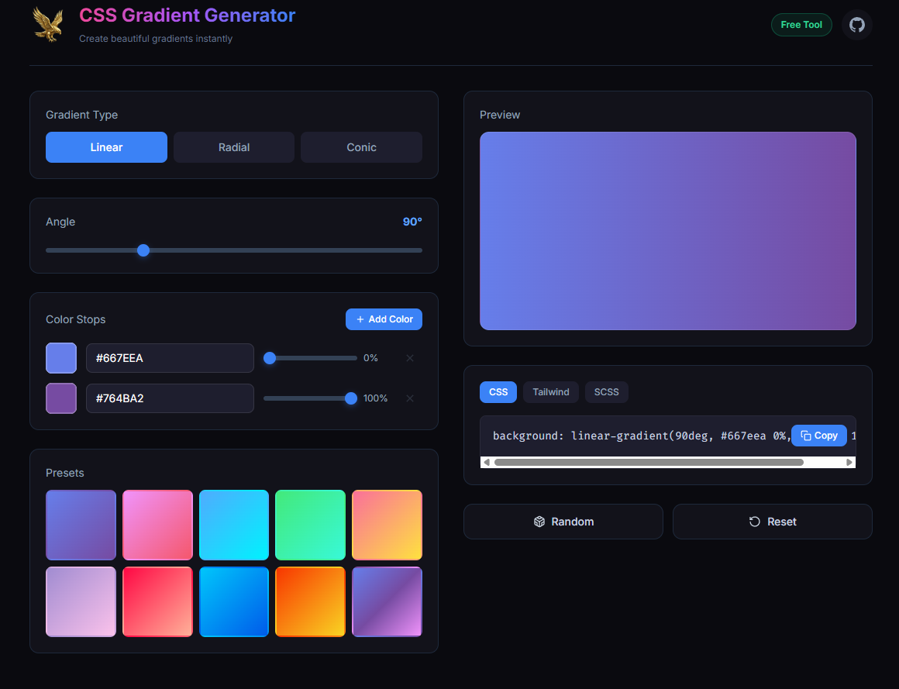

# 🦅 Elsakr CSS Gradient Generator

<div align="center">
  <a href="https://elsakr.company">
    
  </a>
</div>

> **Part of Elsakr Open Source Tools Ecosystem — [View All Tools](https://elsakr.company/tools)**  
> *Stop writing gradients manually! Design beautiful gradients in seconds.*

---

## ⭐ Badges


## 📋 Table of Contents
- [🦅 Elsakr CSS Gradient Generator](#-elsakr-css-gradient-generator)
  - [⭐ Badges](#-badges)
  - [📋 Table of Contents](#-table-of-contents)
  - [🧐 What is it?](#-what-is-it)
  - [✨ Features](#-features)
  - [🚀 Installation \& Usage](#-installation--usage)
  - [🤝 Contributing](#-contributing)
  - [📜 License](#-license)
  - [📞 Contact](#-contact)
  - [🇪🇬 Arabic Version / النسخة العربية](#-arabic-version--النسخة-العربية)

---

## 🧐 What is it?
**Elsakr CSS Gradient Generator** is a visual design tool helping developers create complex linear and radial gradients without remembering CSS syntax. Adjust colors, angles, and opacity with live preview, then copy the auto-generated CSS code.

## ✨ Features
- **Visual Editor**: Drag color stops and change angles visually.
- **Copy-Paste**: Generates cross-browser CSS code.
- **Types**: Supports Linear and Radial gradients.
- **Presets**: Ready-to-use professional gradients.

## 🚀 Installation & Usage


1. **Clone**:
   ```bash
   git clone https://github.com/khalidsakrjoker/Elsakr-CSS-Gradient-Generator.git
   ```
2. **Run**: Open `index.html`.
3. **Integrate**: Use the generated CSS in your projects.

---

## 🤝 Contributing
Got a cool gradient preset? PR it in!

## 📜 License
Distributed under the MIT License. See `LICENSE` for more information.

## 📞 Contact
**Elsakr Tools** - [elsakr.company](https://elsakr.company)  
*Open Source Tools with a Falcon’s Vision.*

---

# 🇪🇬 Arabic Version / النسخة العربية

# 🦅 Elsakr CSS Gradient Generator (مولد التدرجات اللونية)

<div align="center">
  <a href="https://elsakr.company">
    
  </a>
</div>

> **جزء من نظام صقر للأدوات مفتوحة المصدر — [عرض كل الأدوات](https://elsakr.company/tools)**  
> *بطل تكتب كود التدرج بإيدك! صمم تدرجات احترافية في ثواني.*

---

## 🧐 ما هي هذه الأداة؟
أداة تصميم مرئية بتساعد المطورين يصمموا تدرجات لونية (Gradients) معقدة سواء خطية أو دائرية من غير ما يحفظوا كود CSS. عدل الألوان، الزوايا، والشفافية وانت شايف النتيجة قدامك، وانسخ الكود الجاهز.

## ✨ المميزات
- **محرر مرئي**: حرك الألوان وغير الزاوية بالماوس.
- **نسخ ولصق**: بيولد كود CSS يشتغل على كل المتصفحات.
- **أنواع**: يدعم Linear و Radial.
- **قوالب**: تدرجات جاهزة احترافية.

## 🚀 التثبيت والاستخدام
1. **نزل الملفات**: اعمل Clone للريبو.
2. **شغل**: افتح `index.html`.
3. **استخدم**: انسخ الكود وحطه في مشروعك.

## 📞 تواصل معنا
**أدوات صقر** - [elsakr.company](https://elsakr.company)  
*أدوات مفتوحة المصدر برؤية صقر.*
